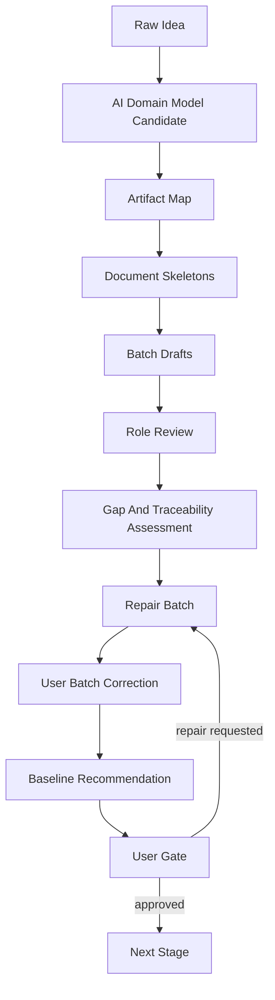

# Design Document Generation Loop v0.1

Status: candidate design
Task: T-0008

## Purpose

This loop replaces one-question-at-a-time discovery with AI-led document generation and review.

The goal is to reach a professional design baseline quickly enough for a one-person non-technical user to make informed gate decisions.

## Loop Overview

## Step 1: Build The Model Before Asking Details

The AI should infer and write a candidate model:

- actors and departments
- business objects
- documents and records
- source systems
- source-of-truth ownership
- main workflows
- exception workflows
- automation boundaries
- business decisions requiring user confirmation

Every uncertain item must be marked as an assumption, not presented as fact.

## Step 2: Generate The Artifact Map

Before writing long documents, the AI should generate a design package map:

- which documents are required now
- which documents are deferred
- which documents are not needed
- which documents must reference each other
- which documents are gate-critical

## Step 3: Create Skeletons

Skeletons should define headings, required tables, traceability fields, and review criteria before detailed drafting.

This prevents missing entire dimensions such as security, test, observability, or release planning.

## Step 4: Draft In Batches

Recommended batches:

| Batch | Documents |
| --- | --- |
| Batch A: Domain And Product | domain model, assumptions ledger, PRD, user journeys, acceptance criteria |
| Batch B: Architecture And Contracts | architecture, API contracts, data model, workflow/state design, event model |
| Batch C: Experience And Governance | UX spec, role/approval matrix, security design, audit model |
| Batch D: Quality And Delivery | test strategy, observability, release/rollback, risk register, sprint plan |
| Batch E: Baseline Review | cross-document index, traceability matrix, gap assessment, repair report |

## Step 5: Run Review And Gap Assessment

The AI should review the batch from multiple roles, then assess gaps against the artifact matrix and the target design depth.

Questions to ask:

- which required artifacts are missing?
- which artifact contradicts another?
- which requirement lacks a test?
- which workflow lacks owner/data/state?
- which security risk lacks mitigation?
- which future feature is accidentally inside MVP?
- which user decision is required before baseline?

## Step 6: Repair Before Asking The User

The AI should repair obvious structural gaps itself.

The AI asks the user only when:

- a business fact is unknown
- a scope tradeoff changes cost/time/value
- a legal/security/production-risk decision is needed
- a gate is required

## Step 7: Batch User Correction

The user receives a concise correction package:

- executive summary
- assumptions needing confirmation
- choices with tradeoffs
- high-risk findings
- proposed gate

The user can respond with corrections in natural language. The AI applies them across all affected artifacts.

## Step 8: Baseline

A design baseline is ready only when:

- required artifacts exist
- P0/P1 findings are repaired or explicitly blocked
- major P2 findings are repaired or explicitly deferred
- traceability is coherent
- MVP and later phases are separated
- evidence and handoff are current
- the user explicitly approves the baseline gate

## Time Target

For a substantial complex project, the repaired method should target:

- 1-2 days for domain model and artifact map
- 2-5 days for first design package drafts
- 2-4 days for review, gap repair, and user correction
- 1-2 days for final baseline packaging

This supports an approximate 1-2 week design-baseline target, compared with an estimated 8-12 weeks or more under linear interview discovery.

## Boundary

This loop is candidate method design only. It is not installed or active as a new operating rule until a later explicit gate approves that change.
