# Lifecycle Stage Map v0.1

Status: candidate design
Task: T-0008

## Purpose

This stage map defines how Loop should move from a raw idea to governed delivery without making the user act as the project team.

## Stage Overview

```mermaid
flowchart LR
  A["Idea Intake"] --> B["AI Domain Model"]
  B --> C["Discovery Baseline"]
  C --> D["PRD Baseline"]
  D --> E["Architecture Baseline"]
  E --> F["Detailed Design Baseline"]
  F --> G["Implementation Plan"]
  G --> H["Coding"]
  H --> I["Testing And Repair"]
  I --> J["Release Gate"]
  J --> K["Operate And Handoff"]
```

## Stages

### S0 Idea Intake

Goal: capture the raw goal, user constraints, non-goals, risk boundaries, and initial gate.

AI work:

- restate the idea
- identify missing context
- propose safe discovery scope
- create the first evidence folder

User work:

- confirm the goal
- approve or reject the discovery/design gate

### S1 AI Domain Model

Goal: create a visible model before deep questioning.

AI work:

- actor and role map
- department or responsibility map
- business object map
- source-of-truth and data authority matrix
- main workflows and exception workflows
- open assumptions ledger

User work:

- correct wrong assumptions in batches
- identify business facts the AI cannot infer

### S2 Discovery Baseline

Goal: convert the domain model into a stable discovery package.

AI work:

- problem statement
- target users and use cases
- scenario map
- MVP candidate
- non-goals
- risk register
- first acceptance criteria

User work:

- approve, narrow, or redirect discovery baseline

### S3 PRD Baseline

Goal: define the product behavior in user-visible terms.

AI work:

- PRD
- user journeys
- functional requirements
- non-functional requirements
- acceptance criteria
- traceability from business goals to requirements

User work:

- approve product scope and tradeoffs

### S4 Architecture Baseline

Goal: define system boundaries and technical direction.

AI work:

- architecture overview
- component map
- integration map
- data ownership model
- build-vs-buy recommendation
- technical risk assessment

User work:

- approve major tradeoffs when they affect cost, time, data, or business operation

### S5 Detailed Design Baseline

Goal: generate implementable design documents.

AI work:

- API contracts
- data model
- front-end UX specification
- workflow/state design
- security design
- observability design
- test strategy
- release and rollback plan
- phase 2-3 target-state notes
- gap assessment

User work:

- review executive summaries and business-facing assumptions
- approve baseline or request repair

### S6 Implementation Planning

Goal: convert the design baseline into an execution plan.

AI work:

- milestone plan
- sprint plan
- dependency graph
- task breakdown
- test plan
- evidence plan

User work:

- approve whether to proceed into coding

### S7 Coding

Goal: implement only inside approved scope.

AI work:

- code changes
- focused tests
- evidence capture
- progress updates

User work:

- approve high-risk changes or scope changes

### S8 Testing And Repair

Goal: prove the implementation against the design baseline.

AI work:

- unit, integration, contract, E2E, security, and regression tests as appropriate
- defect triage
- repair loop
- verification evidence

User work:

- decide whether residual risks are acceptable

### S9 Release Gate

Goal: decide whether to release or hold.

AI work:

- release readiness report
- rollback plan
- monitoring checklist
- known issues

User work:

- approve or reject release

### S10 Operate And Handoff

Goal: keep the work resumable and auditable.

AI work:

- handoff
- evidence index
- open decisions
- operational notes
- next-session startup prompt

User work:

- decide next objective

## Loop Rule

Any stage may loop back when review finds a material gap. The loop must record:

- what failed
- which artifact is affected
- what repair is proposed
- whether user approval is needed

## Gate Rule

No transition into real-project entry, coding, installation, deployment, rollback, high-risk resource action, or rule/runtime behavior change may occur without a separate explicit user gate.
