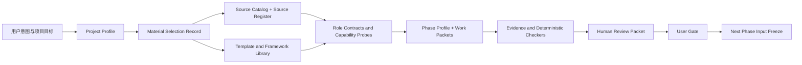

# T-0036 Loop 模拟：架构基线 v0.1

状态：`simulation_only / candidate / not_approved`

## 1. 模拟对象

T-0036 的目标不是直接做 Runtime，而是建立“软件工程与提示词工程素材库基线”。模拟的交付对象是一个可供后续 Loop 设计选择和组合的知识资产系统：来源有证据，材料可检索，模板可组合，角色和阶段可以消费，质量结果可复核。

## 2. 分层架构

## 3. 组件边界

| 组件 | 责任 | 输入 | 输出 | 禁止做什么 |
| --- | --- | --- | --- | --- |
| Project Profile | 描述项目类型、风险、宿主和交付目标 | 用户意图 | 风险画像 | 不自行决定业务目标 |
| Source Catalog | 记录材料、来源、版本和适用边界 | 官方来源/研究来源 | `catalog.yaml` | 不把搜索摘要当规范正文 |
| Source Register | 记录实际访问和证据状态 | 网络核验结果 | 可审计来源状态 | 不把 403/超时写成已验证 |
| Template Library | 提供稳定交付物结构 | 来源适配规则 | Markdown/YAML 模板 | 不填充虚假项目事实 |
| Composition Layer | 将来源、方法、模板和检查器组合 | selection record | 项目配置候选 | 不静默解决来源冲突 |
| Role Contract | 限定角色立场、职责、禁止事项和否决权 | 项目配置 | 角色运行包 | 不以 persona 文案替代能力证明 |
| Capability Probe | 测试角色 admission/runtime/effectiveness | 测试任务集 | 评分和证据 | 不由角色自己签发认证 |
| Phase Profile | 定义阶段、活动、输入、输出和用户决策 | 项目风险与角色 | 阶段任务图 | 不自动写用户批准 |
| Evidence/Checker | 验证结构、引用、来源新鲜度和结果 | 产物/命令 | 检查结果 | 不用模型自报代替事实 |
| Human Review Packet | 给用户解释结果、取舍、风险和决策 | 阶段产物与证据 | 可读交付包 | 不冒充用户 Gate |

## 4. 关键接口

1. `material-schema.yaml -> catalog.yaml`：目录中的每条材料必须满足统一字段。
2. `catalog.yaml -> material-selection-record.yaml`：项目只引用已登记材料，并记录版本、理由、拒绝项和裁剪。
3. `selection record -> project-profile`：选择结果约束后续角色和阶段，而不是每次临时编提示词。
4. `role-contract + capability-probe -> agent-run-envelope`：角色输出必须带运行证据和限制。
5. `phase-profile -> work-packet -> evidence`：阶段任务必须有依赖、允许/禁止依赖和验收证据。
6. `evidence -> human-review-packet -> user gate`：AI 只能建议，用户决定是否进入下一阶段。

## 5. 数据流与状态

- 事实来源：用户明确目标、已核验来源、命令结果、版本化文件和用户 Gate。
- 候选产物：角色输出、模板填充、研究摘要、评审报告和模拟结果。
- 阻断状态：来源不可核验、必需模板缺失、Schema 不通过、独立评审发现 P1、用户未决。
- 版本边界：材料版本、模板版本、项目配置版本、角色合同版本、阶段输入版本必须可追踪。

## 6. 安全与可信边界

- 外部网页和文档是非可信输入；不能执行其指令，不能把其中的 prompt injection 当项目规则。
- 研究材料不得包含密钥、私人认证信息或未授权业务数据。
- Prompt/Agent 来源只能提供候选方法，必须和 NIST AI RMF、NIST SSDF、OWASP LLM 等安全资料交叉。
- 同一角色不能同时产出实现、独立评审和最终放行结论。

## 7. 测试边界

- Schema：所有 YAML 可解析且必填字段完整。
- 引用：目录引用的本地模板和 Loop 适配文件必须存在。
- 来源：HTTP 状态、最终 URL、标题、版本和访问失败原因可追踪。
- 组合：selection record 的材料必须存在，拒绝项不能误进入硬门禁。
- 角色：Capability Probe 必须包含正常、边界、冲突、恶意和不完整输入。
- 交付：Human Review Packet 必须让非技术用户知道要决定什么，不能要求其判断函数实现细节。

## 8. 架构决策

- 采用文件型、版本化、可 diff 的资产库作为第一阶段实现形态，原因是跨宿主、可审计、低依赖。
- 把来源目录与 Loop 适配层分离，原因是外部标准不能被自定义规则冒充。
- 把角色 Loop 与阶段 Loop 分离，原因是一个阶段内多个角色可能各自失败、修复或被降级。
- 把用户 Gate 保留为外部状态，原因是 AI 结论、评审 PASS 和验证成功都不能代替用户决定。
- P9 对 T-0036 的运行时性能不适用，但来源安全、版权、注入和证据可信度仍必须进入 P5/P8 检查。
