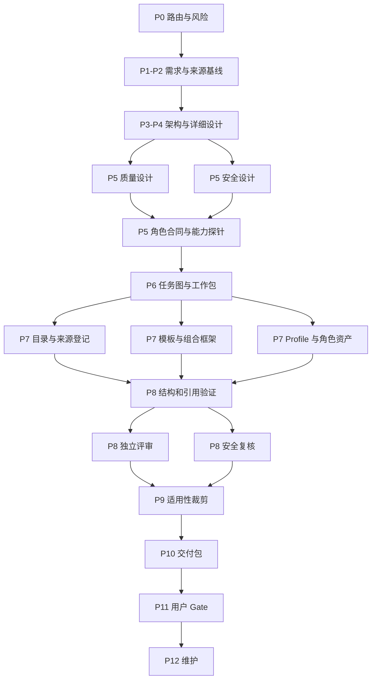

# T-0036 Loop 工程模拟执行方案 v0.1

状态：`simulation_only / candidate / not_approved`

## 模拟目的

把 T-0036 当作真实的软件工程项目，演示 Loop 如何在不让主控临时发明流程的前提下，规划架构、角色、任务依赖、并行边界、质量门禁和人工评审。此文件是“如何执行”的模拟，不代表这些角色已经被真实 Agent 执行，也不代表素材库已获用户验收。

## 项目判定

| 项目项 | 模拟结论 |
| --- | --- |
| 项目类型 | 工程知识/提示词/Agent 素材库 |
| 风险等级 | `HIGH`：会成为未来 Loop 设计输入，但当前不接生产运行时 |
| 路由 | `FULL_LOOP` 的设计与验证范围；P7 仅构建文档资产 |
| 宿主 | Codex，本次只模拟，不调用多 Agent Runtime |
| 用户责任 | 目标、范围、关键取舍和 P0/P1/P2/P3/P5/P10/P11 Gate 决定 |
| AI 责任 | 研究、架构、拆解、产物、检查、评审、修复建议和证据组织 |
| 本次停止点 | P11 用户决定之前；不得自行把 candidate 改成 approved |

## 角色排布

稳定角色全部保留：产品经理、项目经理、交付经理、系统架构师、模块架构师、开发工程师、质量工程师、安全工程师、独立评审员、发布/运维工程师和主控会话。针对 T-0036 增加一个项目专用的“知识/标准研究员”，但它不能替代质量、安全或独立评审。

完整角色合同、输入输出、否决条件和能力探针见 [role-roster.v0.1.yaml](role-roster.v0.1.yaml)。

## 阶段排布

| 阶段 | T-0036 的具体工作 | 主要角色 | 模拟裁剪 | Gate |
| --- | --- | --- | --- | --- |
| P0 | 识别为高风险设计输入项目，冻结范围和宿主能力 | 主控/项目经理 | 保留 | 进入 Full/Controlled Loop |
| P1-P2 | 研究目标、范围、素材分类、来源和验收 | 产品/研究/质量 | 合并，但交付物不合并 | 用户确认需求基线 |
| P3-P4 | 素材库分层架构、Schema、模板、Profile、引用关系 | 系统/模块架构师 | 合并执行，分开评审 | 用户确认架构和取舍 |
| P5 | 质量、证据新鲜度、安全、版权、Prompt Injection | 质量/安全/主控 | 保留 | 用户确认硬门禁 |
| P6 | 任务图、角色工作包、并行和 token/WIP 预算 | 项目经理 | 保留 | 用户确认执行顺序 |
| P7 | 写入目录、来源登记、模板和框架 | 开发/研究 | “实现”是文档资产构建，不是 Runtime | 进入 P8 |
| P8 | YAML、必填字段、引用闭包、覆盖矩阵、独立评审 | 质量/安全/独立评审 | 保留 | 修复或形成交付包 |
| P9 | 记录运行时性能不适用，执行来源新鲜度、成本和研究输入安全检查 | 质量/安全 | 性能测试 `NOT_APPLICABLE`，补偿检查保留 | 用户确认裁剪 |
| P10 | 交付完整性、证据、交接和回滚准备 | 交付/发布运维 | 保留 | 是否可交人工评审 |
| P11 | 用户阅读 Human Review Packet 并决定 | 用户/主控 | 不可由 AI 代行 | `approve/repair/reject/defer` |
| P12 | 来源刷新、材料退役、反馈回归和版本演进 | 研究/项目经理 | 延后到基线接受后 | 周期维护 Gate |

## 任务流

任务图见 [task-graph.v0.1.yaml](task-graph.v0.1.yaml)。核心依赖是：

## 并行规则

可以并行：

- P1-P2 的来源发现与提示词/Agent 评估问题定义；二者都只读 P0 路由结果。
- P5 的质量设计、安全设计和角色合同草拟；写入路径和结论必须分开。
- P7 的来源登记、模板填充、Profile 编写；必须使用已冻结 Schema 和不重叠目录。
- P8 的结构检查、独立评审和安全复核；独立评审不能读取作者解释来替代新鲜上下文。

必须串行：

- 用户目标和 P0 路由 -> P1/P2 基线 -> P3/P4 架构 -> P6 工作包。
- 接口/Schema 冻结前不能大规模并行填充模板。
- P8 发现 P1/P2 后，必须先修复和回归，不能进入 P10。
- P11 用户决定必须晚于交付包生成，且不能由主控写入批准。

## Gate 规则

| Gate | 触发条件 | AI 能做什么 | AI 不能做什么 |
| --- | --- | --- | --- |
| P0 | 路由和风险画像完成 | 建议模式和补充问题 | 自行扩大项目范围 |
| P2 | 研究/需求基线形成 | 生成材料候选与差距 | 把未核验来源变硬规则 |
| P3/P4 | 架构和详细设计完成 | 报告取舍与风险 | 用架构图代替接口/Schema |
| P5 | 质量/安全方案完成 | 推荐门禁和补偿控制 | 质量角色自报 PASS |
| P8 | 结构与独立评审完成 | 要求修复、形成报告 | 评审员修复后自我签字 |
| P10 | 交付包完整 | 给出 READY/NOT_READY 证据 | 代替用户发布批准 |
| P11 | 用户读包 | 解释影响和选项 | 伪造用户批准 |

## Token/返工预算（规划值）

这些是任务排布预算，不是实际消费计量：

| 区域 | 规划 token | 主要控制 |
| --- | ---: | --- |
| P0-P2 | 6k-12k | 先读索引和范围，避免全文加载 |
| P3-P5 | 10k-20k | 架构/质量/安全共享稳定摘要，避免重复研究 |
| P6 | 3k-6k | 用任务图和工作包减少临时讨论 |
| P7 | 12k-24k | 分路径并行，复用模板，禁止重复生成 |
| P8-P10 | 8k-18k | 确定性检查先于长篇评审，失败只重跑受影响包 |
| P11 | 2k-4k | 只给用户读结论、取舍、风险和证据入口 |

真正的成本指标是 `token + tool + review + repair + delay`。任何省 token 的方案若增加返工或降低独立性，都不能算优化。

## 本次模拟的终止条件

模拟停在 P11 之前，输出角色排布、架构基线、任务图、素材选择和交付包结构。下一步不是自动执行全部任务，而是让用户先审阅这些排布是否符合目标；用户批准后才能把模拟方案转为正式 Loop 设计任务，Runtime/Host Adapter 实现仍需单独 Gate。
