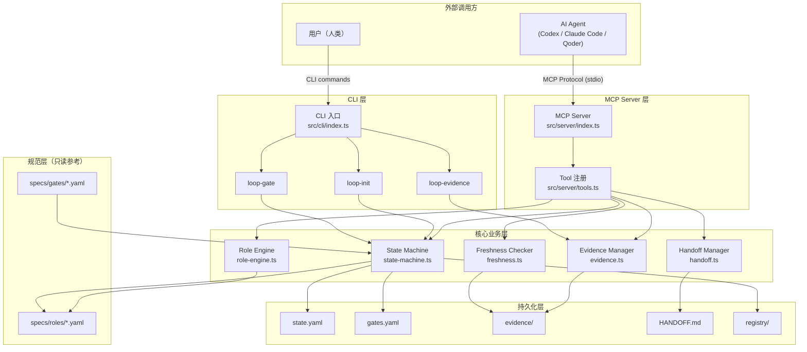
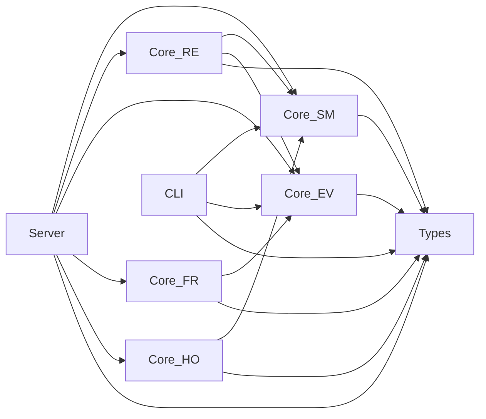
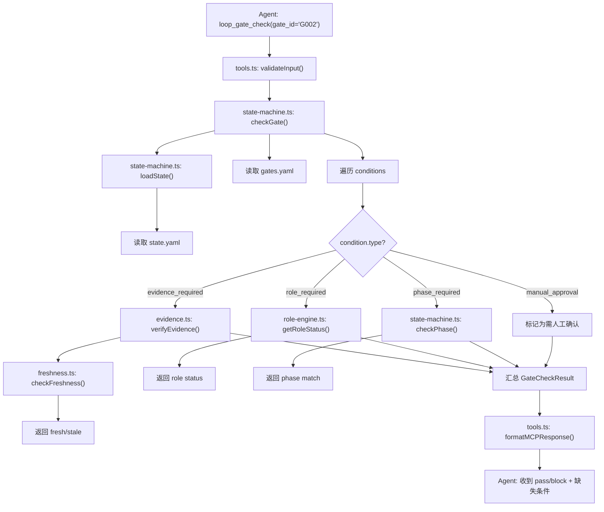
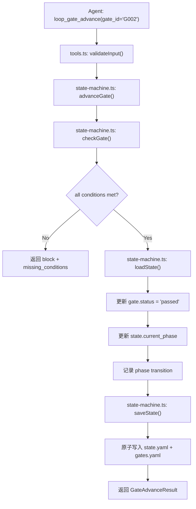
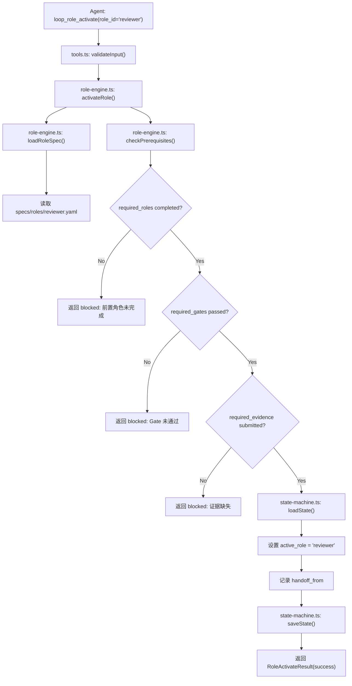
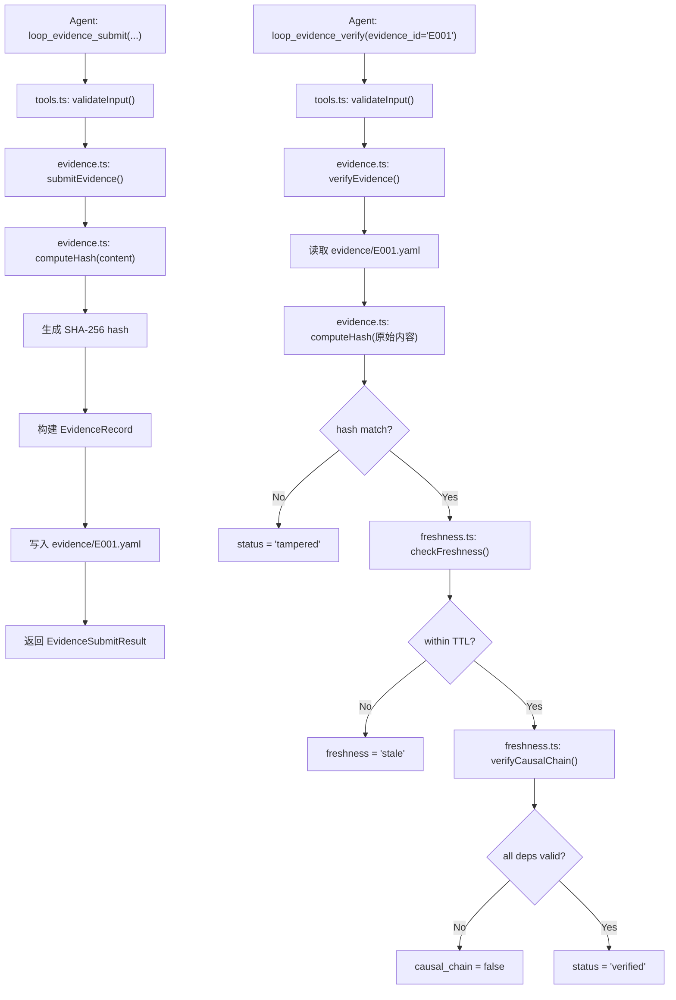
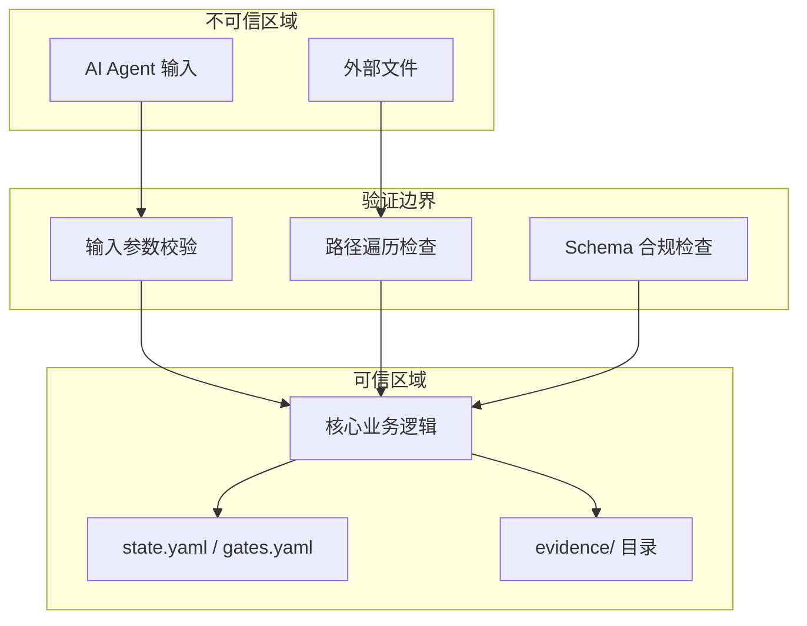

# Loop Engineering MCP Server — Architecture Design

> **Author:** R04 System Architect  
> **Status:** Candidate  
> **Created:** 2026-07-22  
> **Schema Version:** 1

---

## Table of Contents

1. [整体架构](#1-整体架构)
2. [模块清单](#2-模块清单)
3. [组件清单](#3-组件清单)
4. [组件职责](#4-组件职责)
5. [接口定义](#5-接口定义)
6. [数据模型](#6-数据模型)
7. [依赖关系](#7-依赖关系)
8. [调用关系](#8-调用关系)
9. [错误处理策略](#9-错误处理策略)
10. [安全边界](#10-安全边界)
11. [扩展方式](#11-扩展方式)
12. [部署结构](#12-部署结构)
13. [测试边界](#13-测试边界)
14. [架构决策记录（ADR）](#14-架构决策记录adr)

---

## 1. 整体架构

### 1.1 系统架构图



### 1.2 分层说明

| 层 | 职责 | 边界 |
|---|------|------|
| **MCP Server 层** | 接收 AI agent 的 MCP tool call，参数校验，格式化返回 | 只做协议适配，不含业务逻辑 |
| **CLI 层** | 接收人类用户的命令行调用 | 只做参数解析和输出格式化 |
| **核心业务层** | Gate 状态机、角色引擎、证据管理、新鲜度检查、交接管理 | 纯逻辑 + 文件 I/O，无网络依赖 |
| **持久化层** | YAML/Markdown 文件存储 | 原子写入，schema 版本控制 |
| **规范层** | 角色定义、Gate 定义的只读规范 | 不可被运行时修改，只能由用户更新 |

---

## 2. 模块清单

| 模块 | 路径 | 职责 | 边界 |
|------|------|------|------|
| **server** | `src/server/` | MCP 协议适配，tool 注册，请求路由 | 不直接操作文件系统，委托给 core |
| **cli** | `src/cli/` | 命令行入口，参数解析，人类可读输出 | 不直接操作文件系统，委托给 core |
| **core/state-machine** | `src/core/state-machine.ts` | Gate 状态机：注册、检查、推进 | 只读写 state.yaml + gates.yaml |
| **core/role-engine** | `src/core/role-engine.ts` | 角色激活、前置条件检查、权限边界 | 只读 specs/roles/*.yaml + state.yaml |
| **core/evidence** | `src/core/evidence.ts` | 证据提交、hash 绑定、完整性验证 | 只读写 evidence/ 目录 |
| **core/freshness** | `src/core/freshness.ts` | 证据新鲜度检查（TTL + 因果链） | 只读 evidence/ + state.yaml |
| **core/handoff** | `src/core/handoff.ts` | 角色间交接物记录、版本追踪 | 只读写 HANDOFF.md + state.yaml |
| **types** | `src/types/` | TypeScript 类型定义 | 纯类型，无运行时逻辑 |

---

## 3. 组件清单

### 3.1 server 模块

| 组件 | 文件 | 类型 |
|------|------|------|
| S-1 MCP Server 启动器 | `src/server/index.ts` | 入口 |
| S-2 Tool 注册表 | `src/server/tools.ts` | 注册器 |

### 3.2 cli 模块

| 组件 | 文件 | 类型 |
|------|------|------|
| C-1 CLI 路由器 | `src/cli/index.ts` | 入口 |
| C-2 init 命令 | `src/cli/init.ts` | 命令 |
| C-3 gate 命令 | `src/cli/gate.ts` | 命令 |
| C-4 evidence 命令 | `src/cli/evidence.ts` | 命令 |

### 3.3 core/state-machine 模块

| 组件 | 文件 | 类型 |
|------|------|------|
| CM-1 Gate 注册器 | `src/core/state-machine.ts` → `registerGate()` | 函数 |
| CM-2 Gate 检查器 | `src/core/state-machine.ts` → `checkGate()` | 函数 |
| CM-3 Gate 推进器 | `src/core/state-machine.ts` → `advanceGate()` | 函数 |
| CM-4 状态持久化 | `src/core/state-machine.ts` → `loadState()` / `saveState()` | 函数 |

### 3.4 core/role-engine 模块

| 组件 | 文件 | 类型 |
|------|------|------|
| CE-1 角色激活器 | `src/core/role-engine.ts` → `activateRole()` | 函数 |
| CE-2 角色状态查询 | `src/core/role-engine.ts` → `getRoleStatus()` | 函数 |
| CE-3 前置条件检查 | `src/core/role-engine.ts` → `checkPrerequisites()` | 函数 |
| CE-4 角色规范加载 | `src/core/role-engine.ts` → `loadRoleSpec()` | 函数 |

### 3.5 core/evidence 模块

| 组件 | 文件 | 类型 |
|------|------|------|
| EV-1 证据提交器 | `src/core/evidence.ts` → `submitEvidence()` | 函数 |
| EV-2 证据验证器 | `src/core/evidence.ts` → `verifyEvidence()` | 函数 |
| EV-3 Hash 计算器 | `src/core/evidence.ts` → `computeHash()` | 函数 |

### 3.6 core/freshness 模块

| 组件 | 文件 | 类型 |
|------|------|------|
| FR-1 新鲜度检查器 | `src/core/freshness.ts` → `checkFreshness()` | 函数 |
| FR-2 TTL 计算器 | `src/core/freshness.ts` → `calculateTTL()` | 函数 |
| FR-3 因果链验证 | `src/core/freshness.ts` → `verifyCausalChain()` | 函数 |

### 3.7 core/handoff 模块

| 组件 | 文件 | 类型 |
|------|------|------|
| HO-1 交接创建器 | `src/core/handoff.ts` → `createHandoff()` | 函数 |
| HO-2 交接查询器 | `src/core/handoff.ts` → `getHandoffHistory()` | 函数 |
| HO-3 交接物序列化 | `src/core/handoff.ts` → `serializeHandoff()` | 函数 |

### 3.8 types 模块

| 组件 | 文件 | 类型 |
|------|------|------|
| T-1 状态类型 | `src/types/state.ts` | 类型定义 |
| T-2 角色类型 | `src/types/role.ts` | 类型定义 |
| T-3 Gate 类型 | `src/types/gate.ts` | 类型定义 |
| T-4 证据类型 | `src/types/evidence.ts` | 类型定义 |

---

## 4. 组件职责

### S-1 MCP Server 启动器
- 初始化 MCP Server 实例（`@modelcontextprotocol/sdk`）
- 配置 stdio transport
- 注册 tool handler
- 管理 server 生命周期（start / shutdown）

### S-2 Tool 注册表
- 将 9 个 MCP tool 映射到 core 层函数
- 定义每个 tool 的 JSON Schema（inputSchema）
- 参数校验与默认值填充
- 将 core 层返回值格式化为 MCP Content 格式

### C-1 CLI 路由器
- 解析命令行参数（使用 `commander`）
- 路由到对应子命令
- 格式化人类可读输出（表格、颜色）

### C-2 init 命令
- 调用 `loop_init` 逻辑
- 创建 `.ai/` 目录结构
- 生成初始 `state.yaml`、`gates.yaml`
- 输出初始化结果

### C-3 gate 命令
- 子命令：`gate check <gate_id>`、`gate advance <gate_id>`
- 调用 core 层 gate 检查/推进逻辑
- 显示通过/阻塞状态及缺失条件

### C-4 evidence 命令
- 子命令：`evidence submit`、`evidence verify`
- 调用 core 层证据管理逻辑
- 显示 hash、新鲜度状态

### CM-1 Gate 注册器
- 将新 Gate 写入 `gates.yaml`
- 验证 Gate ID 唯一性
- 设置初始状态为 `pending`

### CM-2 Gate 检查器
- 加载 Gate 定义的所有条件
- 逐一检查每个条件是否满足
- 返回 `pass` / `block` + 缺失条件列表
- **不修改任何状态**（纯读操作）

### CM-3 Gate 推进器
- 先调用 Gate 检查器确认所有条件满足
- 若通过，更新 `state.yaml` 中的当前阶段
- 记录推进事件（时间戳、操作者、前置 Gate）
- 若未通过，返回阻塞原因

### CM-4 状态持久化
- 原子读写 `state.yaml`（write-to-temp → rename）
- Schema 版本检查与迁移
- 文件锁（防止并发写入冲突）

### CE-1 角色激活器
- 加载角色规范（`specs/roles/<role>.yaml`）
- 检查前置条件（前置角色是否已完成、Gate 是否通过）
- 记录激活事件到 `state.yaml`
- 触发交接物传递

### CE-2 角色状态查询
- 返回当前激活角色、激活时间、已完成步骤
- 返回角色可用操作列表

### CE-3 前置条件检查
- 检查前置角色是否已交接
- 检查必需 Gate 是否已通过
- 检查必需证据是否已提交

### CE-4 角色规范加载
- 从 `specs/roles/` 读取角色 YAML 定义
- 解析角色权限、前置条件、允许操作

### EV-1 证据提交器
- 接收证据内容（文本或文件路径）
- 计算 SHA-256 hash
- 写入 `evidence/<evidence_id>.yaml`
- 绑定时间戳、提交者、关联 Gate/Role

### EV-2 证据验证器
- 重新计算文件 hash，与记录比对
- 检查文件是否被篡改
- 返回验证结果 + 时间戳

### EV-3 Hash 计算器
- SHA-256 哈希计算
- 支持文本内容和文件路径两种输入

### FR-1 新鲜度检查器
- 检查证据是否在 TTL 内
- 检查证据的因果链是否完整（前置证据是否存在且有效）
- 返回 `fresh` / `stale` / `broken_chain`

### FR-2 TTL 计算器
- 根据证据类型和 Gate 要求计算有效期
- 默认 TTL 可配置

### FR-3 因果链验证
- 追溯证据之间的依赖关系
- 验证前置证据是否存在且未过期
- 检测循环依赖

### HO-1 交接创建器
- 记录交接物（文件列表、上下文摘要、版本）
- 计算交接物 hash
- 追加到 `HANDOFF.md`
- 更新 `state.yaml` 中的 `last_handoff_at`

### HO-2 交接查询器
- 返回交接历史列表
- 支持按角色、时间范围过滤

### HO-3 交接物序列化
- 将交接物结构化为 Markdown 格式
- 包含版本、hash、时间戳、交接双方角色

---

## 5. 接口定义

### 5.1 核心类型接口

```typescript
// ===== src/types/state.ts =====

/** 项目治理状态 */
export interface ProjectState {
  schema_version: number;
  project_name: string;
  current_phase: string;
  current_task_id: string | null;
  current_gate_id: string | null;
  active_role: string | null;
  last_handoff_at: string; // ISO 8601
  phases: PhaseRecord[];
}

export interface PhaseRecord {
  phase_id: string;
  entered_at: string;
  exited_at: string | null;
  status: "active" | "completed" | "skipped";
}

/** state.yaml 读写接口 */
export interface StateStore {
  load(projectRoot: string): Promise<ProjectState>;
  save(projectRoot: string, state: ProjectState): Promise<void>;
}
```

```typescript
// ===== src/types/gate.ts =====

export type GateStatus = "pending" | "passed" | "blocked" | "skipped";

export interface GateCondition {
  condition_id: string;
  type: "evidence_required" | "role_required" | "phase_required" | "manual_approval";
  description: string;
  params: Record<string, unknown>;
}

export interface GateDefinition {
  gate_id: string;
  name: string;
  description: string;
  conditions: GateCondition[];
  status: GateStatus;
  created_at: string;
  passed_at: string | null;
  blocked_reasons: string[];
}

/** gates.yaml 结构 */
export interface GatesRegistry {
  schema_version: number;
  gates: GateDefinition[];
}

/** Gate 检查结果 */
export interface GateCheckResult {
  gate_id: string;
  status: "pass" | "block";
  conditions_total: number;
  conditions_met: number;
  missing_conditions: {
    condition_id: string;
    type: string;
    description: string;
    detail: string;
  }[];
}

/** Gate 推进结果 */
export interface GateAdvanceResult {
  gate_id: string;
  success: boolean;
  previous_phase: string;
  new_phase: string;
  advanced_at: string;
  error?: string;
}
```

```typescript
// ===== src/types/role.ts =====

export type RoleStatus = "inactive" | "active" | "completed" | "blocked";

export interface RoleSpec {
  role_id: string;
  name: string;
  description: string;
  prerequisites: {
    required_roles: string[];       // 必须先完成交接的角色
    required_gates: string[];       // 必须通过的 Gate
    required_evidence: string[];    // 必须提交的证据
  };
  permissions: {
    allowed_operations: string[];   // 允许执行的操作
    allowed_write_paths: string[];  // 允许写入的路径模式
    forbidden_operations: string[]; // 禁止的操作
  };
  handoff_artifacts: string[];      // 交接时必须传递的产物
}

export interface RoleActivation {
  role_id: string;
  status: RoleStatus;
  activated_at: string | null;
  completed_at: string | null;
  activated_by: string;             // "user" | agent session id
  handoff_from: string | null;      // 前一角色
}

/** 角色激活结果 */
export interface RoleActivateResult {
  success: boolean;
  role_id: string;
  status: RoleStatus;
  missing_prerequisites: string[];
  handoff_received: boolean;
  activated_at: string | null;
  error?: string;
}

/** 角色状态查询结果 */
export interface RoleStatusResult {
  role_id: string;
  status: RoleStatus;
  activated_at: string | null;
  completed_at: string | null;
  available_operations: string[];
  allowed_write_paths: string[];
}
```

```typescript
// ===== src/types/evidence.ts =====

export type EvidenceStatus = "submitted" | "verified" | "tampered" | "expired";

export interface EvidenceRecord {
  evidence_id: string;
  type: string;                     // "test_result" | "review_report" | "build_log" | ...
  content: string;                  // 证据内容或文件路径
  content_hash: string;             // SHA-256
  submitted_at: string;
  submitted_by: string;
  gate_id: string | null;           // 关联的 Gate
  role_id: string | null;           // 关联的角色
  ttl_seconds: number | null;       // 有效期，null = 永不过期
  depends_on: string[];             // 依赖的前置证据 ID
  metadata: Record<string, unknown>;
}

/** 证据提交参数 */
export interface EvidenceSubmitParams {
  evidence_id: string;
  type: string;
  content: string;
  gate_id?: string;
  role_id?: string;
  ttl_seconds?: number;
  depends_on?: string[];
  metadata?: Record<string, unknown>;
}

/** 证据提交结果 */
export interface EvidenceSubmitResult {
  success: boolean;
  evidence_id: string;
  content_hash: string;
  stored_at: string;                // 文件路径
  submitted_at: string;
}

/** 证据验证结果 */
export interface EvidenceVerifyResult {
  evidence_id: string;
  status: EvidenceStatus;
  content_hash_match: boolean;
  freshness: "fresh" | "stale" | "no_ttl";
  causal_chain_valid: boolean;
  broken_links: string[];           // 断裂的依赖证据 ID
  verified_at: string;
}
```

### 5.2 交接接口

```typescript
// ===== src/core/handoff.ts 导出类型 =====

export interface HandoffRecord {
  handoff_id: string;
  from_role: string;
  to_role: string;
  created_at: string;
  artifacts: HandoffArtifact[];
  context_summary: string;
  artifacts_hash: string;           // 所有产物 hash 的合并 hash
}

export interface HandoffArtifact {
  path: string;
  description: string;
  content_hash: string;
  version: string;                  // semver 或 timestamp-based
}

export interface HandoffCreateParams {
  from_role: string;
  to_role: string;
  artifacts: { path: string; description: string }[];
  context_summary: string;
}

export interface HandoffResult {
  success: boolean;
  handoff_id: string;
  artifacts_hash: string;
  created_at: string;
  error?: string;
}
```

### 5.3 MCP Tool 接口（Input / Output Schema）

```typescript
// ===== src/server/tools.ts 中每个 tool 的 schema =====

/** loop_init */
interface LoopInitInput {
  project_root: string;
  project_name: string;
  initial_phase?: string;           // 默认 "S0-init"
}
interface LoopInitOutput {
  success: boolean;
  project_root: string;
  files_created: string[];
  state: ProjectState;
}

/** loop_gate_check */
interface LoopGateCheckInput {
  project_root: string;
  gate_id: string;
}
interface LoopGateCheckOutput {
  gate_id: string;
  status: "pass" | "block";
  conditions_total: number;
  conditions_met: number;
  missing_conditions: GateCheckResult["missing_conditions"];
}

/** loop_gate_advance */
interface LoopGateAdvanceInput {
  project_root: string;
  gate_id: string;
  operator?: string;                // 操作者标识
}
interface LoopGateAdvanceOutput {
  success: boolean;
  gate_id: string;
  previous_phase: string;
  new_phase: string;
  advanced_at: string;
  error?: string;
}

/** loop_role_activate */
interface LoopRoleActivateInput {
  project_root: string;
  role_id: string;
  operator?: string;
}
interface LoopRoleActivateOutput {
  success: boolean;
  role_id: string;
  status: RoleStatus;
  missing_prerequisites: string[];
  handoff_received: boolean;
  activated_at: string | null;
  error?: string;
}

/** loop_role_status */
interface LoopRoleStatusInput {
  project_root: string;
  role_id?: string;                 // 不传则返回所有角色
}
interface LoopRoleStatusOutput {
  roles: RoleStatusResult[];
}

/** loop_evidence_submit */
interface LoopEvidenceSubmitInput {
  project_root: string;
  evidence_id: string;
  type: string;
  content: string;
  gate_id?: string;
  role_id?: string;
  ttl_seconds?: number;
  depends_on?: string[];
}
interface LoopEvidenceSubmitOutput {
  success: boolean;
  evidence_id: string;
  content_hash: string;
  stored_at: string;
  submitted_at: string;
}

/** loop_evidence_verify */
interface LoopEvidenceVerifyInput {
  project_root: string;
  evidence_id: string;
}
interface LoopEvidenceVerifyOutput {
  evidence_id: string;
  status: EvidenceStatus;
  content_hash_match: boolean;
  freshness: "fresh" | "stale" | "no_ttl";
  causal_chain_valid: boolean;
  broken_links: string[];
  verified_at: string;
}

/** loop_handoff */
interface LoopHandoffInput {
  project_root: string;
  from_role: string;
  to_role: string;
  artifacts: { path: string; description: string }[];
  context_summary: string;
}
interface LoopHandoffOutput {
  success: boolean;
  handoff_id: string;
  artifacts_hash: string;
  created_at: string;
  error?: string;
}

/** loop_state */
interface LoopStateInput {
  project_root: string;
}
interface LoopStateOutput {
  state: ProjectState;
  gates: GateDefinition[];
  active_role: string | null;
}
```

---

## 6. 数据模型

### 6.1 state.yaml

```yaml
schema_version: 1
project_name: "示例项目"
current_phase: "S1-plan"
current_task_id: "T001"
current_gate_id: "G002"
active_role: "writer"
last_handoff_at: "2026-07-22T10:00:00Z"
phases:
  - phase_id: "S0-init"
    entered_at: "2026-07-22T09:00:00Z"
    exited_at: "2026-07-22T09:30:00Z"
    status: "completed"
  - phase_id: "S1-plan"
    entered_at: "2026-07-22T09:30:00Z"
    exited_at: null
    status: "active"
```

### 6.2 gates.yaml

```yaml
schema_version: 1
gates:
  - gate_id: "G001"
    name: "需求确认 Gate"
    description: "确认用户需求已澄清并记录"
    conditions:
      - condition_id: "C001"
        type: "evidence_required"
        description: "需要需求澄清文档"
        params:
          evidence_id: "E001"
      - condition_id: "C002"
        type: "manual_approval"
        description: "用户确认需求"
        params: {}
    status: "passed"
    created_at: "2026-07-22T09:00:00Z"
    passed_at: "2026-07-22T09:25:00Z"
    blocked_reasons: []
  - gate_id: "G002"
    name: "方案评审 Gate"
    description: "方案已通过评审"
    conditions:
      - condition_id: "C003"
        type: "evidence_required"
        description: "评审报告"
        params:
          evidence_id: "E003"
      - condition_id: "C004"
        type: "role_required"
        description: "reviewer 角色已完成"
        params:
          role_id: "reviewer"
    status: "blocked"
    created_at: "2026-07-22T09:30:00Z"
    passed_at: null
    blocked_reasons: ["评审报告 E003 尚未提交"]
```

### 6.3 evidence/<id>.yaml

```yaml
evidence_id: "E001"
type: "requirement_doc"
content: ".ai/evidence/requirements.md"
content_hash: "sha256:a1b2c3d4..."
submitted_at: "2026-07-22T09:15:00Z"
submitted_by: "writer"
gate_id: "G001"
role_id: "writer"
ttl_seconds: 86400
depends_on: []
metadata:
  file_size: 2048
  line_count: 45
```

### 6.4 HANDOFF.md 格式

```markdown
# Handoff Record

## H001 — writer → reviewer-plan
- **Time:** 2026-07-22T10:00:00Z
- **From:** writer
- **To:** reviewer-plan
- **Artifacts Hash:** sha256:e5f6g7h8...

### Artifacts
| Path | Description | Hash | Version |
|------|-------------|------|---------|
| runs/L001/draft.md | 初稿文档 | sha256:aaaa... | v1 |
| runs/L001/outline.md | 文档大纲 | sha256:bbbb... | v1 |

### Context Summary
writer 完成了初稿文档的编写，基于需求澄清文档 E001。
文档覆盖了所有需求点，但第 3 节需要 reviewer-plan 重点审查结构。
```

### 6.5 specs/roles/writer.yaml（角色规范示例）

```yaml
role_id: "writer"
name: "Writer"
description: "负责文档/代码的初稿编写"
prerequisites:
  required_roles: []
  required_gates: ["G001"]
  required_evidence: ["E001"]
permissions:
  allowed_operations: ["write_draft", "submit_evidence"]
  allowed_write_paths: ["runs/*/draft*", "runs/*/outline*"]
  forbidden_operations: ["approve", "deploy", "modify_stable"]
handoff_artifacts:
  - "runs/*/draft*"
  - "runs/*/outline*"
```

### 6.6 specs/gates/requirement-gate.yaml（Gate 规范示例）

```yaml
gate_id_template: "G{sequence}"
name: "需求确认 Gate"
description: "确认用户需求已澄清并记录"
default_conditions:
  - type: "evidence_required"
    params:
      evidence_type: "requirement_doc"
  - type: "manual_approval"
phase_transition:
  from: "S0-init"
  to: "S1-plan"
```

---

## 7. 依赖关系

### 7.1 模块间依赖方向



### 7.2 依赖规则

| 规则 | 说明 |
|------|------|
| **单向依赖** | 上层 → 下层，禁止反向依赖 |
| **core 内部** | state-machine 是基础，其他模块可依赖它；role-engine 依赖 evidence；freshness 依赖 evidence；handoff 依赖 state-machine |
| **types 无运行时依赖** | types 模块只包含 TypeScript 类型定义，被所有模块引用 |
| **server/cli 不互相依赖** | 两者是独立的入口层，共享 core |
| **core 不依赖 server/cli** | 核心逻辑不知道调用方的存在 |

---

## 8. 调用关系

### 8.1 MCP Tool Call → Gate Check 流程



### 8.2 Gate Advance 流程



### 8.3 Role Activate 流程



### 8.4 Evidence Submit + Verify 流程



---

## 9. 错误处理策略

### 9.1 错误分类

| 类别 | 示例 | 处理方式 |
|------|------|----------|
| **参数错误** | 缺少必填参数、类型不匹配 | 返回 MCP Error Content，HTTP-like 400 |
| **状态错误** | Gate 不存在、角色未注册 | 返回 MCP Error Content，HTTP-like 404 |
| **业务阻塞** | Gate 条件不满足、前置角色未完成 | 返回正常结果 + `success: false` + 原因 |
| **IO 错误** | 文件不存在、权限不足、写入失败 | 重试 1 次，失败后返回 MCP Error，HTTP-like 500 |
| **Schema 错误** | state.yaml 版本不兼容 | 返回迁移建议 + MCP Error |
| **并发冲突** | 两个 agent 同时写入 state.yaml | 文件锁 + 乐观并发控制（version 字段） |

### 9.2 错误响应格式

```typescript
interface LoopError {
  code: string;               // "GATE_NOT_FOUND" | "EVIDENCE_TAMPERED" | ...
  message: string;            // 人类可读描述
  detail?: string;            // 技术细节
  recoverable: boolean;       // 是否可自动恢复
  suggestions?: string[];     // 修复建议
}

// MCP Error 返回格式
{
  isError: true,
  content: [{
    type: "text",
    text: JSON.stringify({
      error: {
        code: "GATE_BLOCKED",
        message: "Gate G002 条件不满足",
        detail: "缺少评审报告 E003",
        recoverable: true,
        suggestions: ["提交评审报告: loop_evidence_submit(evidence_id='E003', type='review_report')"]
      }
    })
  }]
}
```

### 9.3 全局错误处理原则

1. **永远不丢失状态** — 写入使用 write-to-temp → atomic rename
2. **错误信息必须可操作** — 每个错误都带 suggestions
3. **区分 block 和 error** — 业务阻塞不是错误，是正常结果
4. **日志记录** — 所有错误写入 `.ai/logs/error.log`（append-only）
5. **不吞异常** — 未预期的错误必须透传给调用方

---

## 10. 安全边界

### 10.1 信任边界



### 10.2 安全检查清单

| 检查项 | 实现位置 | 说明 |
|--------|----------|------|
| **路径遍历防护** | 所有接受 path 参数的函数 | 禁止 `..`、绝对路径逃逸 project_root |
| **输入长度限制** | tools.ts 参数校验 | content 最大 1MB，path 最大 1024 字符 |
| **Schema 强制校验** | tools.ts + core 入口 | 所有 YAML 读写都做 schema 验证 |
| **操作审计** | state-machine.ts | 每次状态变更记录 operator + timestamp |
| **权限隔离** | role-engine.ts | 角色只能执行 `allowed_operations` 中的操作 |
| **证据不可变** | evidence.ts | 已提交的证据文件不可修改，只能 supersede |

### 10.3 权限模型

```
用户（最高权限）
  ├── 可以批准任何 Gate
  ├── 可以创建/删除角色规范
  ├── 可以强制推进 Gate（覆盖阻塞）
  └── 可以批准破坏性操作

AI Agent（受限权限）
  ├── 可以调用所有 MCP tools
  ├── 受角色权限约束
  ├── 不能执行 forbidden_operations
  ├── 不能写入 allowed_write_paths 之外的路径
  └── 不能跳过 manual_approval 类型的 Gate 条件
```

---

## 11. 扩展方式

### 11.1 添加新角色

1. 在 `specs/roles/` 下创建 `<new-role>.yaml`
2. 定义 `role_id`、`prerequisites`、`permissions`、`handoff_artifacts`
3. 无需修改代码 — role-engine 自动从 specs 目录加载

```yaml
# specs/roles/security-reviewer.yaml
role_id: "security-reviewer"
name: "Security Reviewer"
description: "安全审查角色"
prerequisites:
  required_roles: ["writer"]
  required_gates: ["G002"]
  required_evidence: []
permissions:
  allowed_operations: ["review_security", "submit_evidence"]
  allowed_write_paths: ["runs/*/security-review*"]
  forbidden_operations: ["write_draft", "approve", "deploy"]
handoff_artifacts:
  - "runs/*/security-review*"
```

### 11.2 添加新 Gate

1. 在 `specs/gates/` 下创建 `<new-gate>.yaml`
2. 定义条件模板和阶段转换
3. 运行时通过 `loop_gate_register`（或手动编辑 gates.yaml）注册 Gate 实例
4. 无需修改代码 — state-machine 从 gates.yaml 动态加载

### 11.3 添加新 MCP Tool

1. 在 `src/server/tools.ts` 中添加 tool schema 定义
2. 在 handler 中调用对应的 core 函数
3. 如需新业务逻辑，在 core 层添加新模块

### 11.4 添加新证据类型

1. 无需注册 — evidence 模块接受任意 `type` 字符串
2. 可在 `specs/evidence-types.yaml` 中定义验证规则（可选）

---

## 12. 部署结构

### 12.1 运行环境

| 项 | 要求 |
|---|------|
| Node.js | >= 18.0 |
| 操作系统 | Windows / macOS / Linux |
| 文件系统 | 本地文件系统（无网络存储依赖） |
| 网络 | 不需要（纯本地运行） |

### 12.2 安装方式

```bash
# 方式 1: npm 全局安装（CLI）
npm install -g @loop-engine/cli

# 方式 2: 作为 MCP Server 配置
# 在 AI agent 的 MCP 配置中添加：
{
  "mcpServers": {
    "loop-engine": {
      "command": "npx",
      "args": ["@loop-engine/server"],
      "env": {}
    }
  }
}

# 方式 3: 本地开发
git clone <repo>
cd loop-engine-lab
npm install
npm run build
# MCP Server
node dist/server/index.js
# CLI
node dist/cli/index.js init --project-root ./my-project
```

### 12.3 目录结构（安装后）

```
node_modules/@loop-engine/
├── server/
│   ├── dist/
│   │   ├── server/index.js
│   │   └── server/tools.js
│   └── package.json
├── cli/
│   ├── dist/
│   │   └── cli/index.js
│   └── package.json
└── core/
    ├── dist/
    │   ├── core/state-machine.js
    │   ├── core/role-engine.js
    │   ├── core/evidence.js
    │   ├── core/freshness.js
    │   └── core/handoff.js
    └── package.json
```

### 12.4 package.json 结构

```json
{
  "name": "@loop-engine/monorepo",
  "version": "0.1.0",
  "private": true,
  "workspaces": ["packages/*"],
  "scripts": {
    "build": "tsc -b",
    "test": "vitest run",
    "test:watch": "vitest",
    "lint": "eslint src/ --ext .ts",
    "start:server": "node dist/server/index.js",
    "start:cli": "node dist/cli/index.js"
  },
  "dependencies": {
    "@modelcontextprotocol/sdk": "^1.0.0",
    "yaml": "^2.4.0",
    "commander": "^12.0.0"
  },
  "devDependencies": {
    "typescript": "^5.5.0",
    "vitest": "^2.0.0",
    "@types/node": "^20.0.0",
    "eslint": "^9.0.0"
  }
}
```

---

## 13. 测试边界

### 13.1 测试矩阵

| 模块 | 测试范围 | 不测试 |
|------|----------|--------|
| **state-machine** | Gate 注册/检查/推进逻辑；状态转换正确性；条件匹配；并发写入冲突处理 | YAML 解析库本身 |
| **role-engine** | 角色激活前置条件检查；权限边界；角色规范加载 | 文件系统权限 |
| **evidence** | Hash 计算正确性；证据提交/验证流程；tamper 检测 | 磁盘空间耗尽 |
| **freshness** | TTL 计算；因果链验证；过期判定边界 | 系统时钟漂移 |
| **handoff** | 交接物序列化；hash 计算；HANDOFF.md 格式正确性 | Markdown 渲染 |
| **tools.ts** | 参数校验；错误格式；tool schema 正确性 | MCP SDK 内部 |
| **CLI** | 命令路由；参数解析；输出格式化 | 终端渲染 |

### 13.2 测试策略

```
tests/
├── state-machine.test.ts      # Gate 状态机单元测试
├── role-engine.test.ts        # 角色引擎单元测试
├── evidence.test.ts           # 证据管理单元测试
├── freshness.test.ts          # 新鲜度检查单元测试
├── handoff.test.ts            # 交接管理单元测试
├── tools.test.ts              # MCP tool 集成测试
├── cli.test.ts                # CLI 命令测试
├── fixtures/                  # 测试用 YAML/Markdown 文件
│   ├── state.yaml
│   ├── gates.yaml
│   └── evidence/
└── helpers/
    └── test-state-store.ts    # 内存版 StateStore（测试用）
```

### 13.3 测试原则

1. **Core 层纯单元测试** — 使用内存文件系统（`memfs`）或临时目录
2. **不依赖真实文件系统** — 所有测试使用 fixture
3. **状态机测试覆盖所有转换路径** — pending → passed, pending → blocked, blocked → passed
4. **证据测试覆盖 tamper 场景** — 修改内容后 hash 不匹配
5. **集成测试验证 MCP 协议格式** — 确保 tool 返回符合 MCP spec

---

## 14. 架构决策记录（ADR）

### ADR-001: 选择 TypeScript 作为实现语言

| 项 | 内容 |
|---|------|
| **决策** | 使用 TypeScript（Node.js）作为实现语言 |
| **理由** | 1. AI agent 生态（Codex、Claude Code、Qoder）全部运行在 Node.js 环境<br/>2. MCP SDK（`@modelcontextprotocol/sdk`）官方只提供 TypeScript/JavaScript 版本<br/>3. TypeScript 类型系统适合定义复杂的治理数据结构<br/>4. 目标用户（AI agent 开发者）最熟悉 TypeScript |
| **替代方案** | Python — 现有 checker 脚本是 Python，但与 MCP SDK 不兼容；Rust — 性能更好但生态不成熟 |
| **权衡** | 放弃了与现有 Python checker 脚本的直接复用，需要通过子进程调用或重写 |

### ADR-002: 使用 YAML 作为状态存储格式

| 项 | 内容 |
|---|------|
| **决策** | 使用 YAML 文件（state.yaml、gates.yaml）作为状态持久化格式 |
| **理由** | 1. 人类可读可编辑 — 用户可以直接用文本编辑器查看和修改状态<br/>2. 与现有 `.ai/` 治理文件一致 — 项目已使用 YAML（state.yaml、gates.yaml、registry/）<br/>3. Git 友好 — 可 diff、可 merge、可 blame<br/>4. 无需数据库 — 降低部署复杂度 |
| **替代方案** | SQLite — 更好的并发控制但不可直接阅读；JSON — 可读性差于 YAML；Redis — 过重 |
| **权衡** | 牺牲了并发性能（通过文件锁补偿），换取了可审计性和零依赖 |

### ADR-003: MCP Server + CLI 双入口架构

| 项 | 内容 |
|---|------|
| **决策** | 同时提供 MCP Server 和 CLI 两个入口，共享 core 层 |
| **理由** | 1. AI agent 通过 MCP 协议调用，人类通过 CLI 调用<br/>2. 核心逻辑完全相同，只是入口和输出格式不同<br/>3. CLI 可用于调试、脚本集成、CI/CD<br/>4. 降低测试难度 — core 层只需一套测试 |
| **替代方案** | 只做 MCP Server — 人类使用不便；只做 CLI — agent 无法调用 |
| **权衡** | 需要维护两套入口层的代码，但 core 层完全复用 |

### ADR-004: 证据使用 SHA-256 Hash 绑定

| 项 | 内容 |
|---|------|
| **决策** | 每个证据提交时计算 SHA-256 hash，验证时重新计算比对 |
| **理由** | 1. 防止证据被篡改 — AI agent 提交的证据不应被后续修改<br/>2. 可追溯 — hash 是证据的唯一标识<br/>3. SHA-256 在 Node.js 标准库中可用，无额外依赖<br/>4. 性能足够 — 证据文件通常 < 1MB |
| **替代方案** | Git hash — 依赖 git 存在；CRC32 — 碰撞概率太高 |
| **权衡** | Hash 只能检测篡改，不能防止删除（通过 evidence/ 目录完整性检查补偿） |

### ADR-005: Gate 状态机采用显式条件列表

| 项 | 内容 |
|---|------|
| **决策** | 每个 Gate 定义显式的条件列表（conditions），逐一检查 |
| **理由** | 1. 可审计 — 每个条件的满足/不满足都有明确记录<br/>2. 可扩展 — 新增条件类型只需添加新的 checker<br/>3. 可理解 — AI agent 和用户都能看懂为什么 Gate 被阻塞<br/>4. 与现有 gates.yaml 设计一致 |
| **替代方案** | 规则引擎（如 CEL）— 更灵活但增加复杂度；硬编码 — 不可扩展 |
| **权衡** | 条件类型有限（4 种），不支持自定义逻辑（通过新增条件类型扩展） |

### ADR-006: 角色规范使用外部 YAML 文件

| 项 | 内容 |
|---|------|
| **决策** | 角色定义存储在 `specs/roles/*.yaml`，运行时动态加载 |
| **理由** | 1. 添加新角色无需修改代码<br/>2. 角色定义可被人类审查和编辑<br/>3. 与现有 `roles/*-brief.md` 设计模式一致<br/>4. 支持项目自定义角色 |
| **替代方案** | 硬编码角色 — 不可扩展；数据库存储 — 过重 |
| **权衡** | 启动时需要扫描目录加载，但角色数量通常 < 20，性能无影响 |

### ADR-007: 原子文件写入策略

| 项 | 内容 |
|---|------|
| **决策** | 状态文件写入采用 write-to-temp → fs.rename() 原子操作 |
| **理由** | 1. 防止写入中断导致状态文件损坏<br/>2. Node.js `fs.rename()` 在同一文件系统上是原子的<br/>3. 实现简单，无需外部锁服务 |
| **替代方案** | 文件锁（proper-lockfile）— 更严格但增加依赖；WAL — 过重 |
| **权衡** | 不支持跨进程并发写入（通过操作串行化补偿，单 agent 场景足够） |

### ADR-008: 交接物使用 Markdown 格式

| 项 | 内容 |
|---|------|
| **决策** | HANDOFF.md 使用 Markdown 格式记录交接信息 |
| **理由** | 1. 与现有 `.ai/HANDOFF.md` 格式一致<br/>2. 人类可读 — 交接信息需要被下一个会话的 agent 理解<br/>3. AI agent 天然擅长解析 Markdown<br/>4. Git 友好 |
| **替代方案** | YAML — 不够直观；JSON — 可读性差 |
| **权衡** | Markdown 解析不如 YAML 严格（通过固定格式模板补偿） |

---

## Appendix A: 文件清单总览

```
C:\Users\Administrator\.qoder-cn\loop-engine-lab\
├── package.json
├── tsconfig.json
├── src/
│   ├── server/
│   │   ├── index.ts              # S-1: MCP Server 启动器
│   │   └── tools.ts              # S-2: Tool 注册表
│   ├── cli/
│   │   ├── index.ts              # C-1: CLI 路由器
│   │   ├── init.ts               # C-2: init 命令
│   │   ├── gate.ts               # C-3: gate 命令
│   │   └── evidence.ts           # C-4: evidence 命令
│   ├── core/
│   │   ├── state-machine.ts      # CM-1~4: Gate 状态机
│   │   ├── role-engine.ts        # CE-1~4: 角色引擎
│   │   ├── evidence.ts           # EV-1~3: 证据管理
│   │   ├── freshness.ts          # FR-1~3: 新鲜度检查
│   │   └── handoff.ts            # HO-1~3: 交接管理
│   └── types/
│       ├── state.ts              # T-1: 状态类型
│       ├── role.ts               # T-2: 角色类型
│       ├── gate.ts               # T-3: Gate 类型
│       └── evidence.ts           # T-4: 证据类型
├── tests/
│   ├── state-machine.test.ts
│   ├── role-engine.test.ts
│   ├── evidence.test.ts
│   ├── freshness.test.ts
│   ├── handoff.test.ts
│   ├── tools.test.ts
│   ├── cli.test.ts
│   ├── fixtures/
│   └── helpers/
├── specs/
│   ├── roles/
│   │   ├── writer.yaml
│   │   ├── reviewer.yaml
│   │   ├── reviewer-plan.yaml
│   │   ├── repair.yaml
│   │   └── handoff-editor.yaml
│   └── gates/
│       ├── requirement-gate.yaml
│       ├── design-review-gate.yaml
│       └── promotion-gate.yaml
└── docs/
    └── architecture-design.md    # 本文档
```

---

## Appendix B: MCP Tool 速查表

| Tool | 输入 | 输出 | 幂等 | 副作用 |
|------|------|------|------|--------|
| `loop_init` | project_root, project_name | 创建的文件列表 | 否 | 创建目录和文件 |
| `loop_gate_check` | project_root, gate_id | pass/block + 缺失条件 | 是 | 无 |
| `loop_gate_advance` | project_root, gate_id, operator? | 成功/失败 + 新旧阶段 | 否 | 更新 state.yaml + gates.yaml |
| `loop_role_activate` | project_root, role_id, operator? | 成功/失败 + 缺失条件 | 否 | 更新 state.yaml |
| `loop_role_status` | project_root, role_id? | 角色状态列表 | 是 | 无 |
| `loop_evidence_submit` | project_root, evidence_id, type, content, ... | hash + 存储路径 | 否 | 创建 evidence 文件 |
| `loop_evidence_verify` | project_root, evidence_id | 验证结果 | 是 | 无 |
| `loop_handoff` | project_root, from_role, to_role, artifacts, context | handoff_id + hash | 否 | 更新 HANDOFF.md + state.yaml |
| `loop_state` | project_root | 全局状态 | 是 | 无 |

---

*End of Architecture Design*
